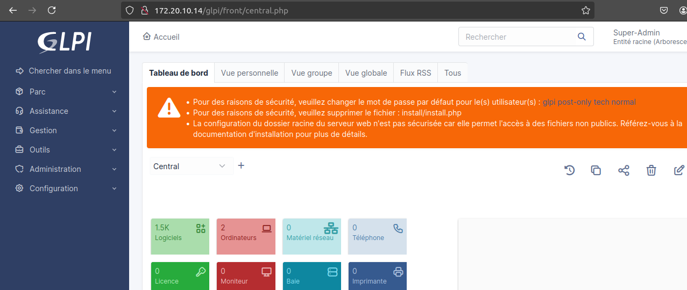

<i>Semaine 3 : Applications métiers et bases de données</i>

## 1. GLPI - Système de gestion de parc informatique et de helpdesk.

GLPI étant déjà installé sur mon système, je vérifie juste l'accès au service ainsi qu'a sa base de données.


<br>

```
reqlu@ubuntu-glpi:~$ sudo mysql
Welcome to the MySQL monitor.  Commands end with ; or \g.
Your MySQL connection id is 52
Server version: 8.0.35-0ubuntu0.22.04.1 (Ubuntu)

Copyright (c) 2000, 2023, Oracle and/or its affiliates.

Oracle is a registered trademark of Oracle Corporation and/or its
affiliates. Other names may be trademarks of their respective
owners.

Type 'help;' or '\h' for help. Type '\c' to clear the current input statement.

mysql> SHOW DATABASES;
+--------------------+
| Database           |
+--------------------+
| TC2_test           |
| db2023_glpi        |
| information_schema |
| mysql              |
| ocsdb              |
| performance_schema |
| sys                |
| tournoi_foot       |
+--------------------+
8 rows in set (0,00 sec)

mysql> use db2023_glpi;
Reading table information for completion of table and column names
You can turn off this feature to get a quicker startup with -A


Database changed
mysql> 
mysql> SHOW TABLES;
+----------------------------------------------------------+
| Tables_in_db2023_glpi                                    |
+----------------------------------------------------------+
| glpi_agents                                              |
| glpi_agenttypes                                          |
| glpi_alerts                                              |
| glpi_apiclients                                          |
| glpi_applianceenvironments                               |
| glpi_appliances                                          |
| glpi_appliances_items                                    |
| glpi_appliances_items_relations                          |
| glpi_appliancetypes                                      |
| glpi_authldapreplicates                                  |
| glpi_authldaps                                           |
| glpi_authmails                                           |
| glpi_autoupdatesystems                                   |
| glpi_blacklistedmailcontents                             |
```
Je vérifie également le port utilisé par le service MYSQL, pour qu'il n'y ai pas de conflit entre POSTGRESQL et MySQL.

```
mysql> SHOW GLOBAL VARIABLES LIKE "PORT";
+---------------+-------+
| Variable_name | Value |
+---------------+-------+
| port          | 3306  |
+---------------+-------+
1 row in set (0,04 sec)

mysql>
```

## 2. PostgreSQL - Système de gestion de bases de données relationnelles, souvent utilisé avec iTop ou GLPI.
### Installation & Setup

```
reqlu@ubuntu-glpi:~$ sudo apt install postgresql postgresql-contrib -y
Reading package lists... Done
Building dependency tree... Done
Reading state information... Done
Les paquets suivants ont été installés automatiquement et ne sont plus nécessaires :
  fonts-glyphicons-halflings ieee-data libapache-dbi-perl libarchive-zip-perl libblas3 libjs-bootstrap libjs-jquery-datatables
  libjs-jquery-file-upload libjs-jquery-migrate-1 libjs-select2.js libldb2 liblinear4 libphp-phpmailer libswitch-perl libtalloc2 libtdb1 libtevent0
  libwbclient0 lua-lpeg nmap nmap-common ocsinventory-reports php-cas php-ldap php-pclzip php-soap php8.1-ldap php8.1-soap phpqrcode
  python-pkg-resources python-setuptools python3-gpg python3-ldb python3-samba python3-talloc python3-tdb samba-common samba-common-bin
  samba-dsdb-modules samba-libs
Veuillez utiliser « sudo apt autoremove » pour les supprimer.
Les paquets supplémentaires suivants seront installés : 
  libcommon-sense-perl libjson-perl libjson-xs-perl libllvm14 libpq5 libsensors-config libsensors5 libtypes-serialiser-perl postgresql-14
  postgresql-client-14 postgresql-client-common postgresql-common sysstat
```

### Setup :

```
reqlu@ubuntu-glpi:~$ sudo -i -u postgres
postgres@ubuntu-glpi:~$ psql
psql (14.13 (Ubuntu 14.13-0ubuntu0.22.04.1))
Type "help" for help.

postgres=# CREATE DATABASE itop_db;
CREATE DATABASE
postgres=# CREATE USER itop_user WITH PASSWORD 'itop2024';
CREATE ROLE
postgres=# GRANT ALL PRIVILEGES ON DATABASE itop_db TO itop_user;
GRANT
postgres=# CREATE DATABASE datagerry_db;
CREATE DATABASE
postgres=# CREATE USER datagerry_user WITH PASSWORD 'datagerry2024';
CREATE ROLE
postgres=# GRANT ALL PRIVILEGES ON DATABASE datagerry_db TO datagerry_user;
GRANT
postgres=# \q
postgres@ubuntu-glpi:~$ exit
logout
reqlu@ubuntu-glpi:~$
```


